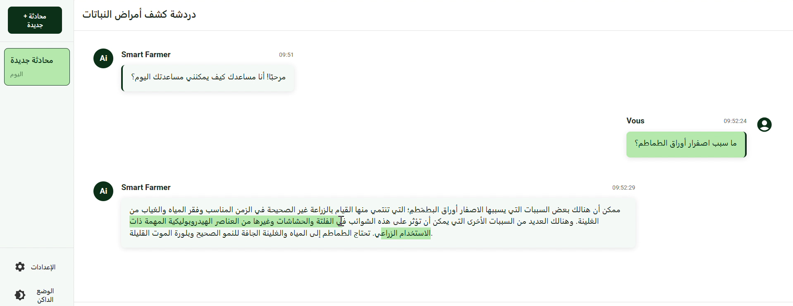
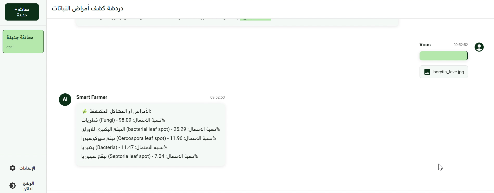

#  Chatbot Agricole – Application Mobile d’Assistance Intelligente pour les Agriculteurs

Le **Chatbot Agricole** est une application mobile indépendante qui fournit une assistance intelligente aux agriculteurs. Grâce à l’intelligence artificielle, il répond aux questions courantes liées à l’agriculture et permet de diagnostiquer les maladies des plantes à partir d’images.

---

## Fonctionnalités principales :

- **Assistance par conversation** : Posez des questions sur les semis, engrais, irrigation, maladies, etc.
- **Conseils personnalisés** : Le chatbot analyse vos questions et fournit des réponses adaptées selon le type de culture et la saison.
- **Diagnostic par image** : Prenez une photo d’une plante malade ou téléchargez-la depuis la galerie pour obtenir un diagnostic immédiat.
- **Interface conviviale** : Facile à utiliser même sans connexion permanente.

---

## Aperçu de l'application

### 1. Interface du Chatbot – Poser une question

### 2. Prendre une photo pour diagnostic

### 3. Upload d’une photo depuis la galerie

---

## Objectif :
Aider les agriculteurs à **résoudre rapidement leurs problèmes agricoles**, améliorer la productivité, et **réduire les pertes liées aux maladies**, en utilisant un outil simple, mobile et intelligent.

---

